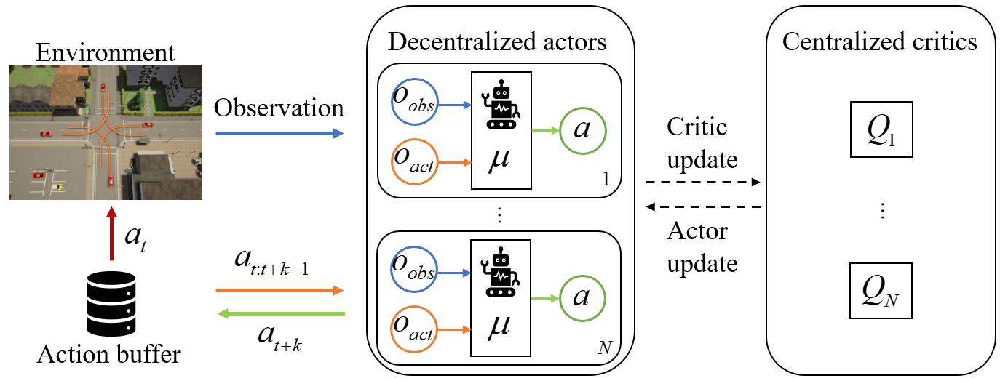

# Delay-Aware Multi-Agent Reinforcement Learning

**Abstract** Action and observation delays exist prevalently in the real-world cyber-physical systems which may pose challenges in reinforcement learning design. It is particularly an arduous task when handling multi-agent systems where the delay of one agent could spread to other agents. To resolve this problem, this paper proposes a novel framework to deal with delays as well as the non-stationary training issue of multi-agent tasks with model-free deep reinforcement learning. We formally define the Delay-Aware Markov Game that incorporates the delays of all agents in the environment. To solve Delay-Aware Markov Games, we apply centralized training and decentralized execution that allows agents to use extra information to ease the non-stationary issue of the multi-agent systems during training, without the need of a centralized controller during execution. Experiments are conducted in multi-agent particle environments including cooperative communication, cooperative navigation, and competitive experiments. We also test the proposed algorithm in traffic scenarios that require coordination of all autonomous vehicles to show the practical value of delay-awareness. Results show that the proposed delay-aware multi-agent reinforcement learning algorithm greatly alleviates the performance degradation introduced by delay.

## Requirements

* [OpenAI baselines](https://github.com/openai/baselines), commit hash: 98257ef8c9bd23a24a330731ae54ed086d9ce4a7
* Multi-agent Particle Environments (https://github.com/shariqiqbal2810/multiagent-particle-envs)
* [PyTorch](http://pytorch.org/), version: 0.3.0.post4 or higher
* [OpenAI Gym](https://github.com/openai/gym), version: 0.9.4
* [Tensorboard](https://github.com/tensorflow/tensorboard), version: 0.4.0rc3 and [Tensorboard-Pytorch](https://github.com/lanpa/tensorboard-pytorch), version: 1.0 (for logging)

## Results

### Cooperative communication

Two cooperating agents are involved in this task, a speaker and a listener. They are spawned in an environment with three landmarks of different colors. The goal of the listener is to navigate to a landmark of a particular color. However, the listener can only observe the relative position and color of the landmarks, excluding which landmark it must navigate to. On the contrary, the speaker knows the color of the goal landmark, and it can send out a message at each time step which is heard by the listener. Therefore, to finish the cooperative task, the speaker must learn to output the correct landmark color. 

 

### Cooperative navigation

 In this environment, three agents must collaborate to 'cover' all of the three landmarks in the environment by movement. In addition, these agents occupy a large physical space and are punished when they collide with each other.

 

### Predator-prey

In this environment, three slower cooperative predators must catch up with a faster prey in a randomly generated environment, with two large landmarks blocking the way. Each time a collaborating predator collides with the prey, the predators will be rewarded and the prey will be punished. The agents can observe the relative position and speed of other agents as well as the positions of the landmarks.

 

### Unsignalized intersection
This scenario consists of four vehicles coming from four directions (north, south, west, east) of the intersection, respectively. The goal of the vehicles is to take a left turn at the intersection. The environment is provided at https://github.com/baimingc/highway_multiagent_env.

 
